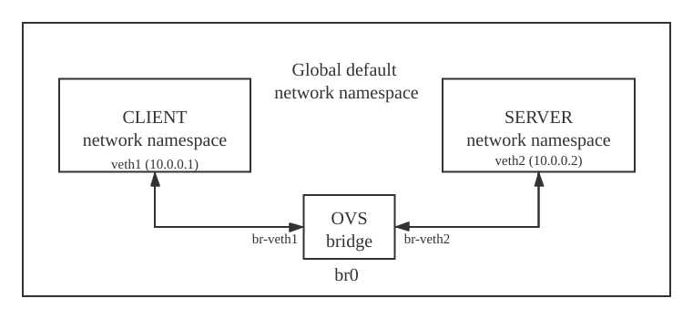

# Isolate UDP Socket Demo
This is a UDP echo server demo program. Unlike conventional UDP programs, the server and the client in this program are located in different network namespace. Two different network namespaces are connected by a bridge br0 created by OpenvSwitch. 



The program works very simple: the client (C) sends a Hello from client message, and the server (S) replies with a Hello from server message.

=======

这是一个 UDP Hello World 示例代码，其效果十分简单：客户端（C）发送 Hello from client 消息，服务器（S）收到后回复 Hello from server 消息。

但与常规 UDP socket 不同，客户端 C 和服务端 S 均处于隔离的 Network namespace 中，两个隔离的网络空间通过 OpenvSwitch 交换机连接。如上图所示


# Usage
Here we use ovs instead of linux bridge, and you can still use linux bridge just with some small modifications of the source code if you really want.

```sh
$ git clone git@github.com:yanjiulab/isolate-socket.git

# create br0
$ sudo apt install openvswitch-switch  # suppose you are a ubuntu user
$ sudo ./config  

# compile
$ make

# run
$ sudo ./isolate_server  # in one terminal
Server start at 10.0.0.2:8080... 
Client[10.0.0.1:60859] : Hello from client
Hello message sent.
 
$ sudo ./isolate_client  # in another terminal
Hello message sent.
Server[10.0.0.2:8080] : Hello from server
``` 

# Refs
- [UDP Server-Client implementation in C](https://www.geeksforgeeks.org/udp-server-client-implementation-c/)
- [A deep dive into Linux namespaces, part 4](http://ifeanyi.co/posts/linux-namespaces-part-4/), [source code here](https://github.com/iffyio/isolate)

 

